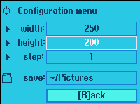

#+title: sc
X11 screenshot tool for tiling window managers

* Dependencies
- Raylib
- Raygui /(included in repo)/
- Xlib
- Cmake
- picom /(should be running in background)/

* How to build
#+BEGIN_VERSE
If *Xlib* and *Raylib* are installed, then it's simple:
#+END_VERSE
#+BEGIN_SRC bash
  cd sc_source/
  mkdir build && cd build
  cmake -S .. -B
  make
#+END_SRC

* About picom
My =WM= is Qtile. Without *picom* it's impossible to create
transparent window.

It's required by program logic to be able to create window with /blank/ background color.
** My Qtile config snippet
The following snippet shows the way to run
*picom* in the background in case of Qtile.
#+BEGIN_SRC python
@hook.subscribe.startup_once
def start_picom():
    os.system("picom &")
#+END_SRC
* About tiling managers
Before I made this program, my way to take screenshots was not
obvious and simple.

I used [[https://github.com/Beykir/shotgun][shotgun]] to take screenshots, but it's CLI.
So I used to take screenshot of entire screen, then crop what I need with
[[https://github.com/hdvpdrm/cropper][cropper]].

It's too ridiculos, so I deicided to write my own tool.

*sc* provides keyboard-driven controls, but you can use mouse if you wish.
That's why it fits into environment controlled by *tiling* window manager.

* *sc* workflow
When you execute program, first thing you see is initial menu.

[[imgs/start_menu.png]]

You have *3* buttons. Each button is associated with a *key*.
- [F]ullscreen   :: press button or press *F* to create fullscreen screenshot.
- *[R]ectangle*    :: press button or press *R* to start choosing rectangular area.
- *[C]config menu* :: opens config menu.

* Fullscreen
Nothing special. Press *F* and screenshot is saved as /png/ image in specified directory.

* Rectangle
This is mode that provides ability to take screenshot of rectangular area, represented
by rectangle with +magenta+ color.
** Keybindings
- *WASD/ARROWS* :: move rectangle around.
- *Q*           :: increment rectangle's step.
- *R*           :: decrement rectangle's step.
- *Z*           :: increase rectangle's width by step.
- *X*           :: increase rectangle's height by step.
- *C*           :: decrease rectangle's width by step.
- *V*           :: decrease rectangle's height by step.
- *SPACE*       :: hide/show rectangle's border.
- *ENTER*       :: take screenshot of area within rectangle.
** Mouse
- *Left Mouse Button*  :: set rectangle's top-left vertex position.
- *Right Mouse Button* :: set rectangle's right-bottom vertex position.  
** Notes
- hit *SPACE* before pressing *ENTER*, unless you want to see rectangle's border on screenshot picture.
- rectangle's step equals to 1 by default.  

* Config menu

** Available options to configure
- *width*   :: determines width of rectangle
- *height*  :: determines height of rectangle
- *step*    :: determines rectangle's step
- *save*    :: determines directory where screenshots are saved
** Note
Press *B* to get back to start menu. Or click button.
