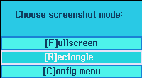

#+title: sc
X11 screenshot tool for tiling window managers

* Dependencies
- Raylib
- Raygui /(included in repo)/
- Xlib
- Cmake
- picom /(should be running in background)/

* How to build
#+BEGIN_VERSE
If *Xlib* and *Raylib* are installed, then it's simple:
#+END_VERSE
#+BEGIN_SRC bash
  cd sc_source/
  mkdir build && cd build
  cmake -S .. -B
  make
#+END_SRC

* About picom
My =WM= is Qtile. Without *picom* it's impossible to create
transparent window.

It's required by program logic to be able to create window with /blank/ background color.
** My Qtile config snippet
The following snippet shows the way to run
*picom* in the background in case of Qtile.
#+BEGIN_SRC python
@hook.subscribe.startup_once
def start_picom():
    os.system("picom &")
#+END_SRC
* About tiling managers
Before I made this program, my way to take screenshots was not
obvious and simple.

I used [[https://github.com/Beykir/shotgun][shotgun]] to take screenshots, but it's CLI.
So I used to take screenshot of entire screen, then crop what I need with
[[https://github.com/hdvpdrm/cropper][cropper]].

It's too ridiculos, so I deicided to write my own tool.

*sc* provides keyboard-driven controls, but you can use mouse if you wish.
That's why it fits into environment controlled by *tiling* window manager.

* *sc* workflow
When you execute program, first thing you see is initial menu.

